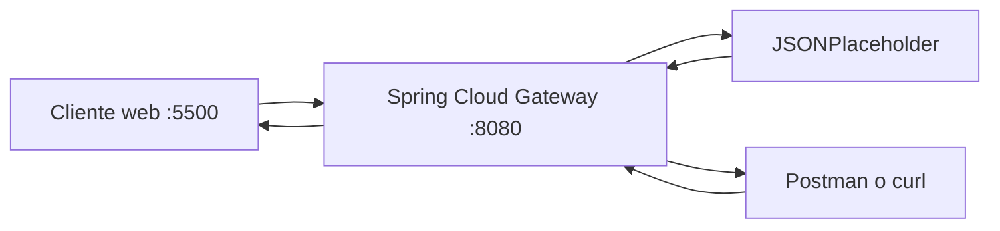

# Laboratorio 1 - API Gateway local con Spring Cloud Gateway

Asignatura: DSY1107 - Desarrollo Cloud Native I  
Semana: 01  
Modalidad: grupal

## Integrantes
- Francisca Guerrero (Rana)
- Nicolas Perez (sicseven)
- Benjamin Aravena (yaelbenja)
- Francisca Lopez (gei)

## Objetivo
Comprender el rol de un API Gateway como punto de entrada unico, aplicando routing, versionado, politicas transversales y CORS mediante configuracion, sin implementar logica de negocio en Java ni backend propio.

## Arquitectura



## Cliente, gateway y backend
- Cliente: envia solicitudes HTTP y consume respuestas.
- Gateway: endpoint unico, routing, transformacion y politicas transversales.
- Backend: API de prueba JSONPlaceholder.

## Requisitos
- JDK 21 o superior
- Maven 3.9+
- Git
- Postman o curl
- Navegador

## Instrucciones para ejecutar

1. Iniciar gateway:

```bash
cd gateway
mvn spring-boot:run
```

2. URL gateway:

```text
http://localhost:8080
```

3. Servir cliente web en puerto 5500:

```text
http://localhost:5500
```

## Rutas configuradas
- /api/v1/posts
- /api/v1/posts/{id}
- /api/v2/posts
- /api/v2/posts/{id}

Integracion:
- https://jsonplaceholder.typicode.com

Transformacion:
- RewritePath elimina /api/v1 o /api/v2 antes de enviar al backend.

## Pruebas HTTP
Resultados observados:
- GET /api/v1/posts -> 200
- GET /api/v1/posts/1 -> 200
- POST /api/v1/posts -> 201
- PUT /api/v1/posts/1 -> 200
- DELETE /api/v1/posts/1 -> 200
- GET /api/v2/posts/1 -> 200

Headers observados:
- X-API-Version: v1 o v2 segun ruta
- X-Gateway-Lab: DSY1107

## RMM nivel 2
Se evidencia Richardson Maturity Model nivel 2 por:
- recursos identificables
- metodos HTTP con semantica
- status codes HTTP

## Estrategia de versionado
- v1 y v2 coexisten para permitir migracion gradual.
- v1 se retira cuando todos los consumidores migran y termina la deprecacion.
- Version de URL no implica version unica de servidor desplegado.

## Header transversal
- X-Gateway-Lab: DSY1107 en respuestas del gateway.

## CORS
Configuracion aplicada:
- Origen permitido: http://localhost:5500
- Metodos permitidos: GET, POST, PUT, DELETE, OPTIONS
- Headers permitidos: *

Preflight validado:
- OPTIONS /api/v1/posts -> 200
- Access-Control-Allow-Origin: http://localhost:5500
- Access-Control-Allow-Methods: GET,POST,PUT,DELETE,OPTIONS

## Responsabilidades gateway vs backend
- Gateway: routing, transformacion de rutas, politicas transversales, observabilidad perimetral.
- Backend: logica de negocio, reglas de negocio y persistencia.

## Problemas encontrados
- Ejecucion inicial de maven fuera de carpeta gateway.
- Conflicto temporal por puerto 8080 en uso.

## Evidencia de colaboracion GitHub
Ramas esperadas:
- feature/routing-v1
- feature/version-v2
- feature/cors
- docs/evidencias

Completar con enlaces reales a Pull Requests por integrante.

## Evidencias detalladas
- docs/evidencias.md

## Conclusiones
El laboratorio permite comprender conceptos de API Gateway que luego se trasladan a Amazon API Gateway: punto de entrada unico, rutas, integraciones, versionado, politicas transversales y CORS.
