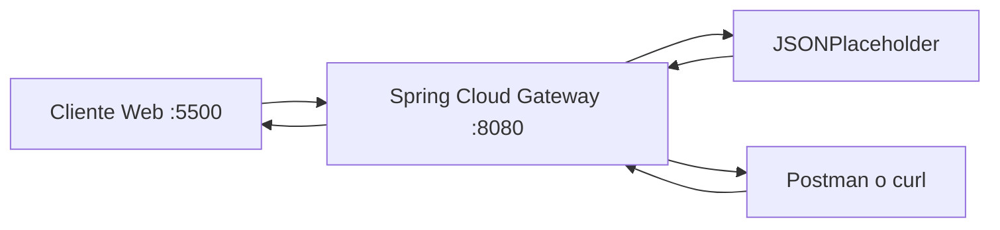

# Evidencias - Laboratorio API Gateway

## Integrantes
- Nombre: Francisca Guerrero (Rana)
- Nombre: Nicolas Perez (sicseven)
- Nombre: Benjamin Aravena (yaelbenja)
- Nombre: Francisca Lopez (gei)

## 1. Backend directo

| Metodo | URL | Status | Observacion |
|---|---|---:|---|
| GET | https://jsonplaceholder.typicode.com/posts | 200 | Coleccion de posts |
| GET | https://jsonplaceholder.typicode.com/posts/1 | 200 | Recurso individual |

Que informacion del backend conoce el cliente en este escenario?

Respuesta:
- El cliente conoce la URL fisica real del backend (jsonplaceholder.typicode.com).
- El cliente conoce la estructura de recursos publicos (/posts y /posts/1).
- Si el backend cambia dominio o rutas, el cliente se debe actualizar.

---

## 2. Arquitectura final



Responsabilidad por componente:
- Cliente web: inicia solicitudes HTTP y muestra resultados.
- Postman/curl: ejecuta pruebas HTTP controladas.
- Gateway: punto de entrada unico, routing, versionado y politicas transversales.
- Backend: entrega recursos de prueba.

---

## 3. Pruebas HTTP mediante gateway

| Metodo | URL | Status | Headers relevantes | Interpretacion |
|---|---|---:|---|---|
| GET | /api/v1/posts | 200 | X-API-Version: v1, X-Gateway-Lab: DSY1107 | Coleccion |
| GET | /api/v1/posts/1 | 200 | X-API-Version: v1, X-Gateway-Lab: DSY1107 | Recurso individual |
| POST | /api/v1/posts | 201 | X-API-Version: v1, X-Gateway-Lab: DSY1107 | Creacion simulada |
| PUT | /api/v1/posts/1 | 200 | X-API-Version: v1, X-Gateway-Lab: DSY1107 | Actualizacion simulada |
| DELETE | /api/v1/posts/1 | 200 | X-API-Version: v1, X-Gateway-Lab: DSY1107 | Eliminacion simulada |

Body usado en POST:

```json
{
  "title": "Cloud Native",
  "body": "Laboratorio API Gateway",
  "userId": 1
}
```

Body usado en PUT:

```json
{
  "id": 1,
  "title": "Cloud Native actualizado",
  "body": "Prueba PUT mediante gateway",
  "userId": 1
}
```

---

## 4. Routing

- URL solicitada por cliente: http://localhost:8080/api/v1/posts/1
- id de route: posts-v1
- Predicate que hizo match: Path=/api/v1/posts/**
- URI/integracion destino: https://jsonplaceholder.typicode.com
- Path final en backend: /posts/1
- Funcion de RewritePath: elimina el prefijo /api/v1 para enrutar al backend con la ruta esperada.

Recorrido:

cliente -> gateway -> backend -> gateway -> cliente

---

## 5. Versionado

- Evidencia /api/v1: GET http://localhost:8080/api/v1/posts/1
- Header X-API-Version observado: v1
- Evidencia /api/v2: GET http://localhost:8080/api/v2/posts/1
- Header X-API-Version observado: v2

Respuestas:
1. v1 y v2 coexisten para compatibilidad mientras evoluciona el contrato.
2. Clientes antiguos o integraciones de terceros pueden seguir en v1.
3. Se retira v1 cuando todos migran y termina el periodo de deprecacion.
4. Versionar URL/contrato no es lo mismo que versionar el servidor desplegado.

---

## 6. Header transversal

- Header esperado: X-Gateway-Lab: DSY1107
- Evidencia observada: presente en respuestas de /api/v1 y /api/v2
- Por que es transversal: aplica a todas las rutas del gateway y no depende de logica de negocio.

---

## 7. CORS

### Antes de configurar CORS

- URL cliente web: http://localhost:5500
- Endpoint consultado: http://localhost:8080/api/v1/posts/1
- Resultado esperado sin CORS: bloqueo por navegador (Same-Origin Policy)
- Mensaje esperado en consola: ausencia de Access-Control-Allow-Origin para ese origen

### Despues de configurar CORS

- Access-Control-Allow-Origin: http://localhost:5500
- Access-Control-Allow-Methods: GET,POST,PUT,DELETE,OPTIONS

### Preflight OPTIONS

Request:

curl -i -X OPTIONS http://localhost:8080/api/v1/posts -H "Origin: http://localhost:5500" -H "Access-Control-Request-Method: POST"

Resultado:
- Status: 200
- Headers relevantes:
  - Access-Control-Allow-Origin: http://localhost:5500
  - Access-Control-Allow-Methods: GET,POST,PUT,DELETE,OPTIONS

Respuestas:
1. Postman no aplica la politica Same-Origin del navegador.
2. Preflight es una solicitud OPTIONS previa para consultar permisos CORS.
3. CORS no autentica ni autoriza usuarios de negocio.
4. Permitir cualquier origen sin analisis aumenta riesgo de abuso desde frontends no confiables.

---

## 8. Richardson Maturity Model nivel 2

Se observa nivel 2 porque:
- Hay recursos identificables (/posts, /posts/1).
- Se usan metodos HTTP con semantica (GET, POST, PUT, DELETE).
- Se usan status codes HTTP (200, 201).

---

## 9. Responsabilidades

| Responsabilidad | Cliente | Gateway | Backend | Justificacion |
|---|:---:|:---:|:---:|---|
| routing |  | X |  | El gateway decide el destino de cada ruta |
| logica de negocio |  |  | X | Corresponde al backend |
| autenticacion/autorizacion |  | X | X | Puede resolverse en gateway o backend segun arquitectura |
| transformacion de rutas |  | X |  | RewritePath es responsabilidad del gateway |
| persistencia |  |  | X | Almacenamiento en backend |
| rate limiting |  | X |  | Politica transversal tipica de gateway |
| reglas de negocio |  |  | X | Deben quedar en servicios de dominio |
| observabilidad |  | X | X | Ambos aportan trazas y metricas |

---

## 10. Problemas encontrados

1. Problema: ejecucion de maven fuera de carpeta gateway.
   - causa: comando desde raiz sin pom activo para spring-boot:run.
   - solucion: ejecutar desde gateway.

2. Problema: puerto 8080 en uso.
   - causa: proceso previo activo.
   - solucion: detener proceso del puerto 8080 y reiniciar.

---

## 11. Colaboracion GitHub

| Integrante | Rama | Pull Request | Aporte principal |
|---|---|---|---|
| Francisca Guerrero | feature/routing-v1 | Pendiente enlace | Validacion rutas v1 |
| Nicolas Perez | feature/version-v2 | Pendiente enlace | Versionado v2 y headers |
| Benjamin Aravena | feature/cors | Pendiente enlace | Configuracion CORS y preflight |
| Francisca Lopez | docs/evidencias | Pendiente enlace | Documentacion y evidencias |

Agregar enlaces reales a Pull Requests del repositorio grupal.

---

## 12. Conclusiones

- El gateway desacopla cliente y backend, y centraliza politicas transversales.
- En Amazon API Gateway el equivalente son rutas, integraciones, politicas y CORS.
- El aprendizaje clave es independiente de Spring: punto de entrada unico, versionado, semantica HTTP y separacion de responsabilidades.
